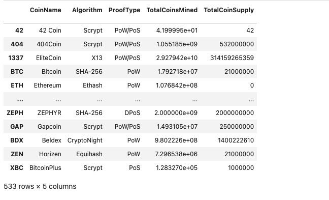
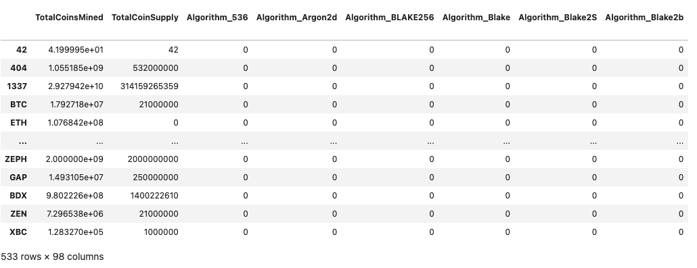
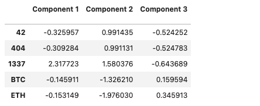
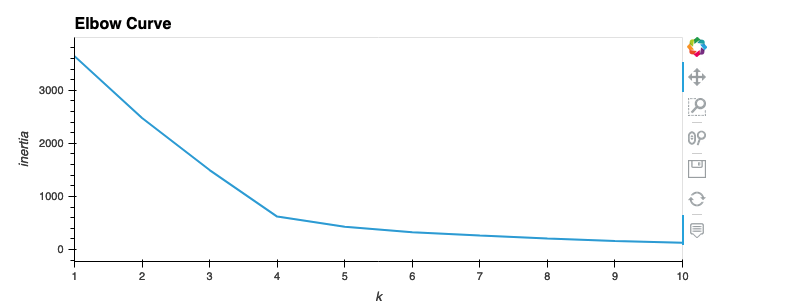
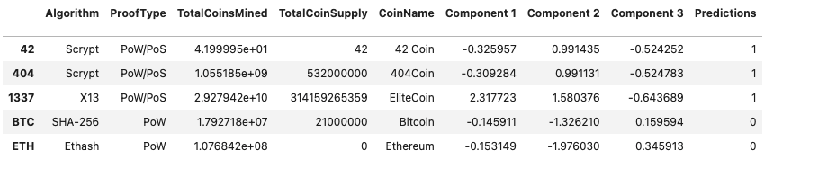
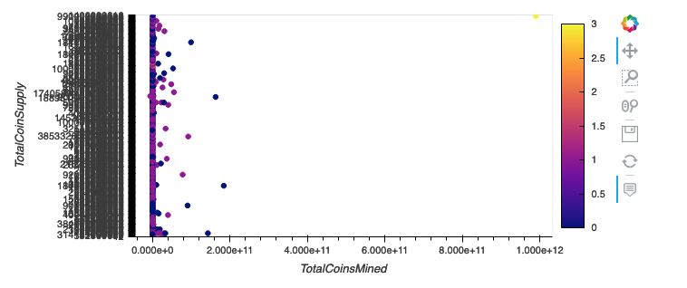
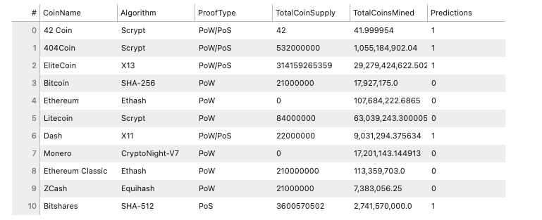
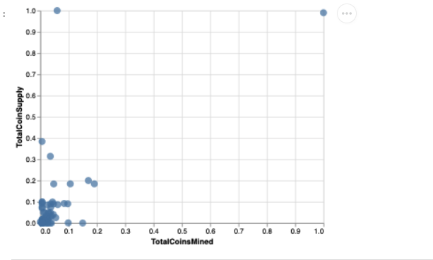

# Clustering Crypto

### Background
Generated a report of what cryptocurrencies are available on the trading market and how they can be grouped using classification.
Used unsupervivsed learning skills into action by clustering cryptocurrencies and created plots to present the results.

Processing Details: 
1) **Data Preprocessing**
     
   
    
   
    
2) **Reducing Data Dimensions Using PCA**
    
   
    
3) **Clustering Cryptocurrencies Using K-Means**
        
   
        
   
    
4) **Visualizing Results**
    
   
        
   
        
   

